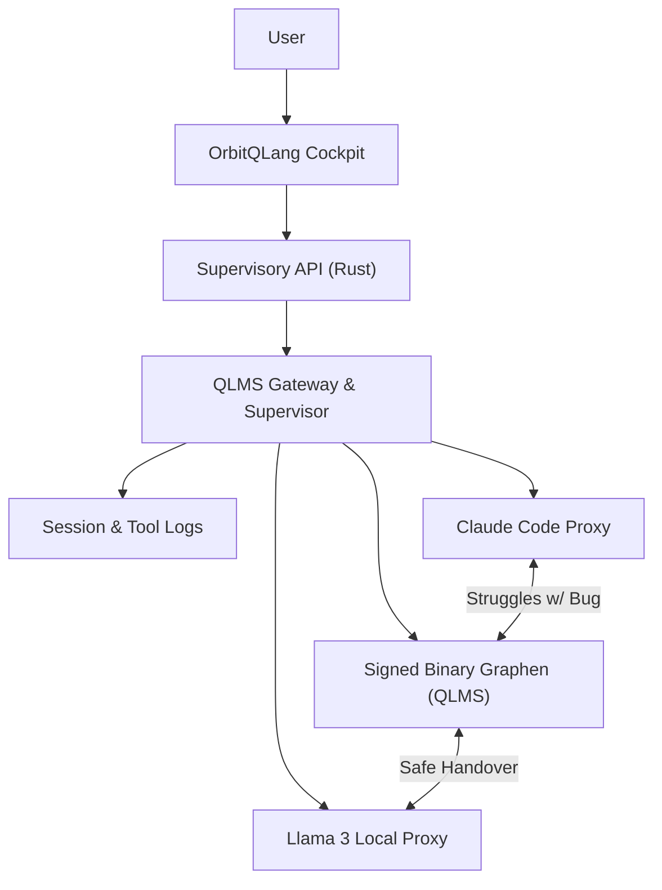

# OrbitQLang

## The Agent-to-Agent Control Plane

OrbitQLang is a **graph-native AI-to-AI control plane** designed strictly for secure, deterministic agent coordination. 

The traditional way to connect multiple AI agents (e.g., Claude, Codex, Gemini) relies on "loose text" prompts across chat interfaces. This approach is lossy, insecure, token-heavy, and prone to hallucination.

**OrbitQLang replaces text-chats between AIs with a cryptographically signed, binary graph protocol (QLMS).**

## Core Capabilities

1. **Signed AI-to-AI Handovers (QLMS)**: Instead of generating text, agents output structured tensors packed into a Directed Acyclic Graph (DAG). This graph is cryptographically signed (HMAC-SHA256) by the Rust backend, ensuring absolute security and auditability.
2. **Deterministic Context Management**: The Rust supervisor decides *what* context the LLM sees. The LLM only acts as the "reasoning engine" and is isolated from the underlying data management.
3. **Model-Agnostic Supervisor**: Plug any model (OpenAI, Anthropic, Ollama) into the QLMS proxy. The proxy handles the translation between raw text APIs and the secure QLMS binary protocol.
4. **Browser Cockpit (`qo`)**: A Mission Control UI to observe agent sessions, tool calls, and binary handovers in real-time.



## Quick Start (Offline Build)

To build OrbitQLang on Windows using the GNU Toolchain (see `docs/BUILD_WINDOWS.md` for full environment setup):

```bash
git clone https://github.com/Mirkulix/qland.git
cd qland/qlang

# Start the QO server
cargo run --bin qo --offline
```

Open `http://localhost:3000/supervisor` (or your configured port) to access the cockpit.

## The QLMS Handover Example

Instead of Claude telling Codex "I found a bug on line 5", OrbitQLang enforces a structured CLI handover:

```powershell
# Agent A proposes a change
cargo run --bin coding-handover --offline -- create `
  --from claude `
  --to codex `
  --phase analyze `
  --request "Inspect parser crash" `
  --output handoff.qlms

# Agent B receives the verified binary context and acts
cargo run --bin coding-handover --offline -- reply `
  --input handoff.qlms `
  --from codex `
  --to claude `
  --change "Guard empty token stream" `
  --output handoff-reply.qlms
```

## Architecture

```text
qlang/
├── crates/
│   ├── qlang-core/        # Crypto (Constant-time SHA256), Base Tensors, Graph definitions
│   ├── qlang-compile/     # LLVM backend config
│   ├── qlang-runtime/     # Graph executor
│   └── qlang-agent/       # QLMS protocol specs
│       └── qlm-bridge/    # (Gateway/Proxy transforming LLM JSON -> QLMS)
├── qo/
│   ├── qo-server/         # Axum HTTP + WebSocket + SSE Dashboard
│   └── qo-agents/         # LLM routing mechanisms
└── frontend/              # React UI
```

## License

MIT — see `LICENSE`.
